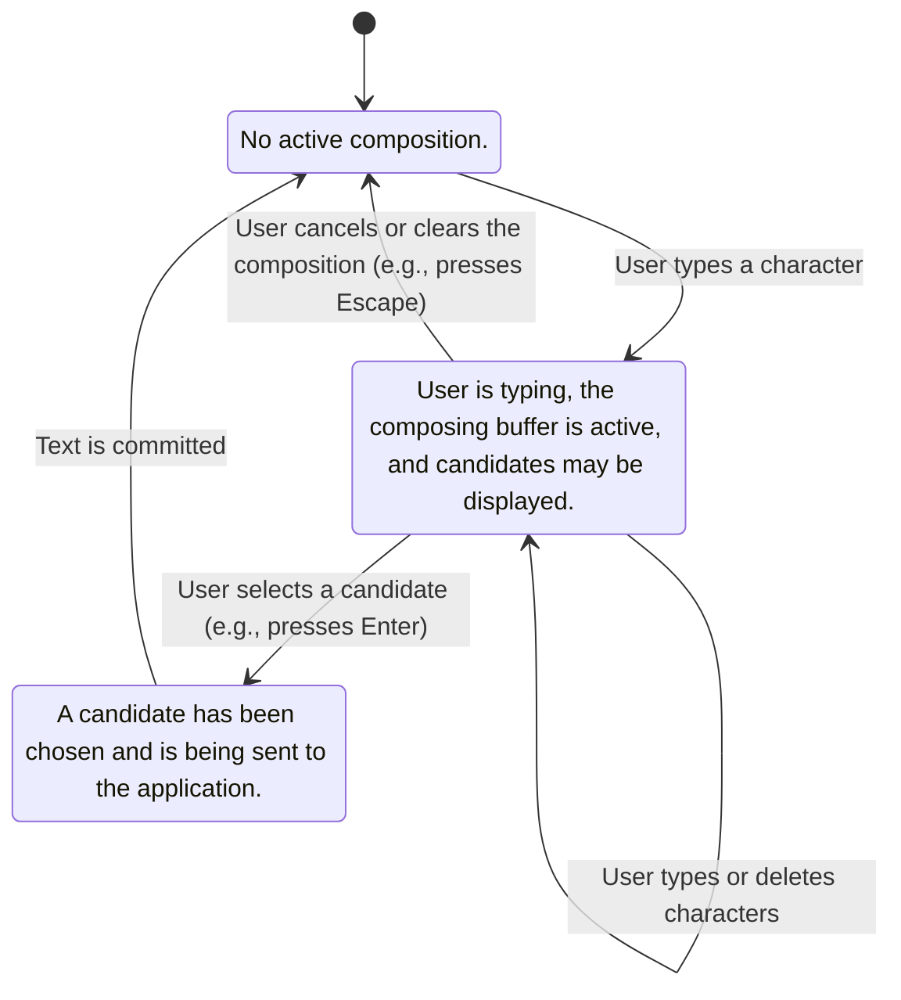

# Input Method State Diagram

This document illustrates the state transitions of the input method engine, based on the states defined in `src/input_method/InputState.ts`.

```mermaid
stateDiagram-v2
    [*] --> EmptyState
    EmptyState: No active composition.

    InputtingState: User is typing, the composing buffer is active, and candidates may be displayed.

    CommittingState: A candidate has been chosen and is being sent to the application.

    EmptyState --> InputtingState: User types a character
    InputtingState --> InputtingState: User types or deletes characters
    InputtingState --> CommittingState: User selects a candidate (e.g., presses Enter)
    InputtingState --> EmptyState: User cancels or clears the composition (e.g., presses Escape)
    CommittingState --> EmptyState: Text is committed
```
